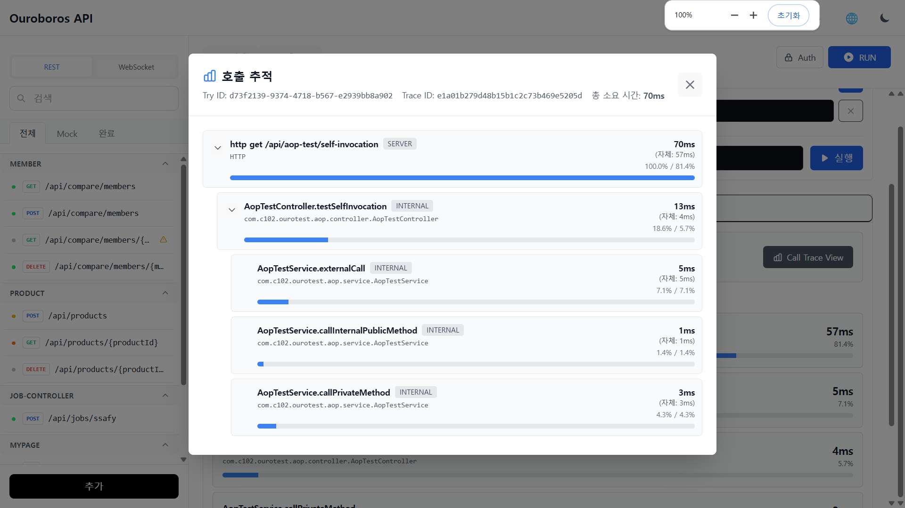
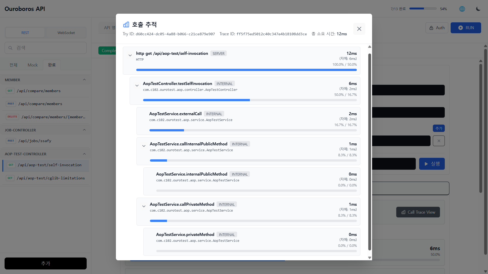
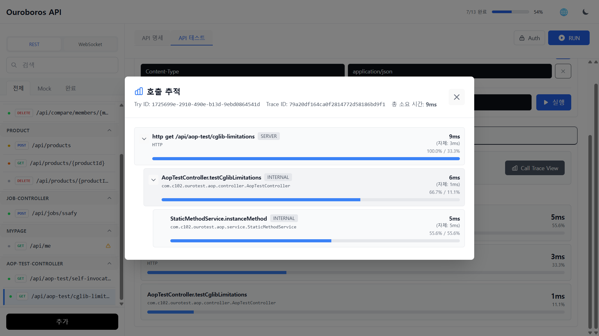
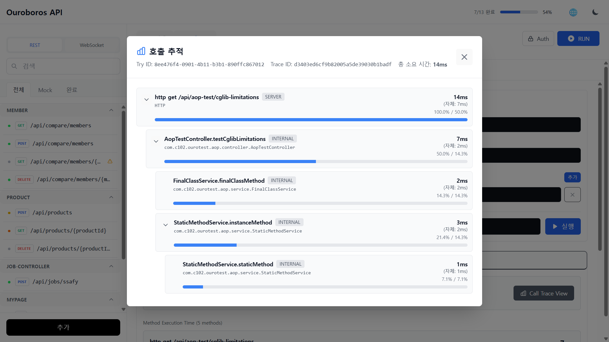

# AspectJ Method Tracing Setup Guide

Ouroboros's AspectJ mode enables you to trace all methods without Spring AOP limitations.

## Why Use AspectJ Mode?

**Spring AOP (Default Mode)** cannot trace:
- Self-invocation (method calls within the same class)
- Private methods
- Final Class methods
- Static methods

**AspectJ Mode** enables:
- Tracing of all methods
- Reduced runtime overhead through compile-time weaving

## Quick Start (Gradle)

### 1. Configure build.gradle

```gradle
plugins {
    id 'java'
    id 'org.springframework.boot' version '3.5.6'
    id 'io.spring.dependency-management' version '1.1.7'

    // Add AspectJ plugin
    id 'io.freefair.aspectj.post-compile-weaving' version '8.11'
}

dependencies {
    implementation 'io.github.whitesnakegang:ouroboros:1.1.0'

    // AspectJ configuration (just add these 2 lines!)
    aspect 'io.github.whitesnakegang:ouroboros:1.1.0'
    aspect 'org.aspectj:aspectjweaver:1.9.22'

    // ... other dependencies
}
```

### 2. Configure application.properties

```properties
ouroboros.method-tracing.enabled=true
ouroboros.method-tracing.allowed-packages=com.example.service, com.example.repository

# Enable AspectJ mode
ouroboros.method-tracing.mode=ASPECTJ  # Add mode configuration
```

### 3. Build and Run

```bash
./gradlew clean build
./gradlew bootRun
```

## Verify It's Working

If you see the following logs on application startup, you're all set:

```
AspectJ Compile-Time Weaving Mode Enabled for Method Tracing

Mode: ASPECTJ (Compile-Time Weaving)
Successfully retrieved AspectJ singleton instance via aspectOf()
```

## For Maven Users

```xml
<dependencies>
    <dependency>
        <groupId>io.github.whitesnakegang</groupId>
        <artifactId>ouroboros</artifactId>
        <version>1.1.0</version>
    </dependency>
</dependencies>

<build>
    <plugins>
        <plugin>
            <groupId>dev.aspectj</groupId>
            <artifactId>aspectj-maven-plugin</artifactId>
            <version>1.14</version>
            <configuration>
                <complianceLevel>17</complianceLevel>
                <aspectLibraries>
                    <aspectLibrary>
                        <groupId>io.github.whitesnakegang</groupId>
                        <artifactId>ouroboros</artifactId>
                    </aspectLibrary>
                </aspectLibraries>
            </configuration>
            <executions>
                <execution>
                    <goals>
                        <goal>compile</goal>
                    </goals>
                </execution>
            </executions>
        </plugin>
    </plugins>
</build>
```

## Troubleshooting

### "aspectOf() method not found" Warning

**Cause**: Missing AspectJ weaving configuration

**Solution**:
1. Verify plugin in `build.gradle`:
   ```gradle
   id 'io.freefair.aspectj.post-compile-weaving' version '8.11'
   ```

2. Verify `aspect` configuration:
   ```gradle
   aspect 'io.github.whitesnakegang:ouroboros:1.1.0'
   aspect 'org.aspectj:aspectjweaver:1.9.22'
   ```

3. Run clean build:
   ```bash
   ./gradlew clean build
   ```

### Methods Not Being Traced

1. **Check Try request header**:
   ```bash
   curl -H "X-Ouroboros-Try: true" http://localhost:8080/api/test
   ```

2. **Verify package configuration**:
   ```properties
   # Ensure package names are correct
   ouroboros.method-tracing.allowed-packages[0]=com.example
   ```

3. **Enable debug logging**:
   ```properties
   logging.level.kr.co.ouroboros=DEBUG
   ```

## Testing

```bash
# 1. Send a Try request
curl -H "X-Ouroboros-Try: true" http://localhost:8080/api/test

# Check the tryId in response header:
# X-Ouroboros-Try-Id: 550e8400-e29b-41d4-a716-446655440000

# 2. Retrieve the trace
curl http://localhost:8080/ouro/tries/550e8400-e29b-41d4-a716-446655440000
```

### AspectJ Mode Tracing Result Example

#### Test Code Example: Self-Invocation and Private Methods

Here's the actual code used to test Self-invocation and Private methods in AspectJ mode:

```java
@RestController
@RequestMapping("/api/aop-test")
public class AopTestController {

    private final AopTestService aopTestService;

    @GetMapping("/self-invocation")
    public ResponseEntity<String> testSelfInvocation() {
        aopTestService.externalCall();
        // Self-invocation: direct call to methods within the same class
        aopTestService.callInternalPublicMethod();
        aopTestService.callPrivateMethod();
        return ResponseEntity.ok("Self-invocation test completed");
    }
}

@Service
public class AopTestService {

    // Method called from outside
    public void externalCall() {
        System.out.println("External call");
    }

    // Public method called via self-invocation
    public void callInternalPublicMethod() {
        internalPublicMethod();
    }

    public void internalPublicMethod() {
        System.out.println("Internal public method");
    }

    // Private method invocation
    public void callPrivateMethod() {
        privateMethod();
    }

    // Private method
    private void privateMethod() {
        System.out.println("Private method");
    }
}
```


*Self-invocation and private methods are missing from the trace in Spring AOP mode*

As shown in the image above:
- ✅ `AopTestController.testSelfInvocation` (Controller method)
- ✅ `AopTestService.externalCall` (External call)
- ✅ `AopTestService.callInternalPublicMethod` (Self-invocation)
- ❌ `AopTestService.internalPublicMethod` (Internal public method - **Missing from trace**)
- ✅ `AopTestService.callPrivateMethod` (Private method invocation)
- ❌ `AopTestService.privateMethod` (Private method - **Missing from trace**)

Spring AOP mode cannot trace Self-invocation and private methods.


*Example showing Self-invocation and Private methods being traced in AspectJ mode*

As shown in the image above:
- ✅ `AopTestController.testSelfInvocation` (Controller method)
- ✅ `AopTestService.externalCall` (External call)
- ✅ `AopTestService.callInternalPublicMethod` (Self-invocation)
- ✅ `AopTestService.internalPublicMethod` (Internal public method)
- ✅ `AopTestService.callPrivateMethod` (Private method invocation)
- ✅ `AopTestService.privateMethod` (Private method)

**Using AspectJ mode** allows you to trace Self-invocation and Private methods!

## Comparison: Spring AOP vs AspectJ

| Feature | Spring AOP | AspectJ |
|---------|-----------|---------|
| Self-invocation | Not supported | Supported |
| Private methods | Not supported | Supported |
| Static methods | Not supported | Supported |
| Configuration complexity | Simple | Slightly complex |
| Build time | Fast | Slightly slower |
| Runtime performance | Proxy overhead | Minimal overhead |

### Spring AOP (CGLIB) Limitations Example

#### Test Code Example: Final class and Static Methods

Here's the actual code used to test Final class and Static method limitations in Spring AOP mode:

```java
@RestController
@RequestMapping("/api/aop-test")
public class AopTestController {

    private FinalClassService finalClassService;
    private final StaticMethodService staticMethodService;


    @GetMapping("/cglib-limitations")
    public ResponseEntity<String> testCglibLimitations() {
        finalClassService.finalClassMethod();
        staticMethodService.instanceMethod();
        return ResponseEntity.ok("CGLIB limitations test completed");
    }
}

@Service
public final class FinalClassService {

    public void finalClassMethod() {
        System.out.println("Final class method called");
    }
}

@Service
public class StaticMethodService {

    // Instance method (can be traced)
    public void instanceMethod() {
        System.out.println("Instance method called");

        // Static method call (cannot be traced by Spring AOP)
        staticMethod();
    }

    // Static method (cannot be traced by Spring AOP!)
    public static void staticMethod() {
        System.out.println("Static method called");
    }
}
```


*Final class and Static methods are missing from the trace in Spring AOP mode*

As shown in the image above:
- ✅ `AopTestController.testCglibLimitations` (Controller method)
- ✅ `StaticMethodService.instanceMethod` (Instance method)
- ❌ `FinalClassService.finalClassMethod` (Final method - **proxy creation failure (inheritance error causing server shutdown)**)
- ❌ `StaticMethodService.staticMethod` (Static method - **Missing from trace**)

Spring AOP mode cannot trace Final class and Static methods.


*Example showing Final and Static methods being traced in AspectJ mode*

As shown in the image above:
- ✅ `AopTestController.testCglibLimitations` (Controller method)
- ✅ `StaticMethodService.instanceMethod` (Instance method)
- ✅ `FinalClassService.finalClassMethod` (Final method)
- ✅ `StaticMethodService.staticMethod` (Static method)

**Using AspectJ mode** allows you to trace Self-invocation, Private, Final class, and Static methods!

## Learn More

- [Ouroboros GitHub](https://github.com/whitesnakegang/ouroboros)
- [AspectJ Official Documentation](https://www.eclipse.org/aspectj/)

---

**If issues persist**: Please report at [GitHub Issues](https://github.com/whitesnakegang/ouroboros/issues).
