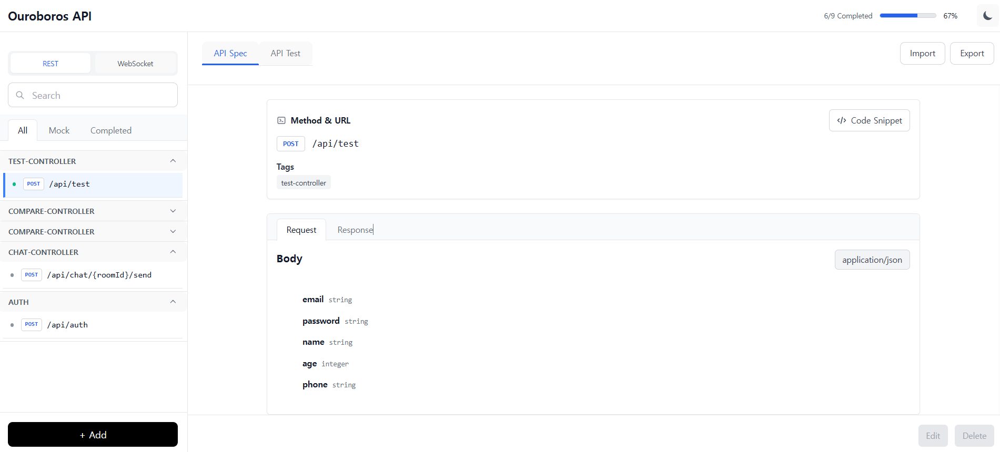
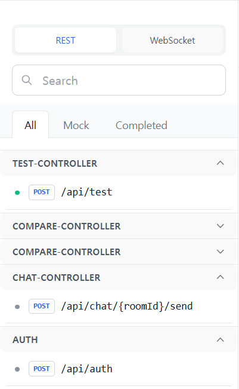
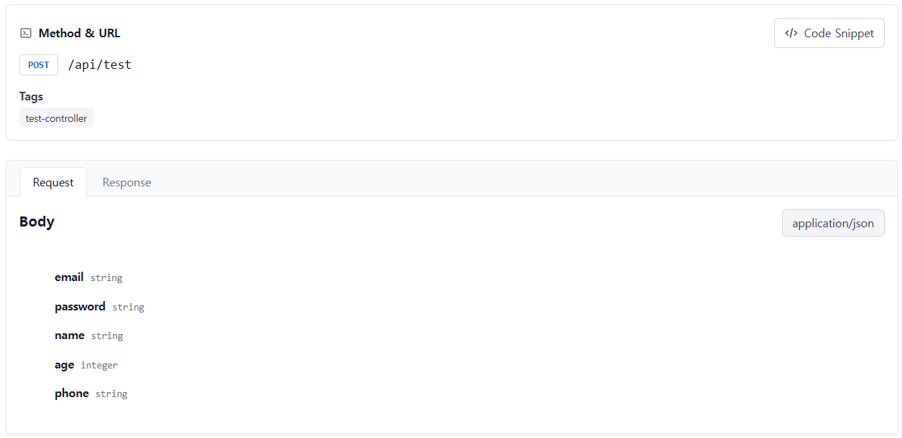
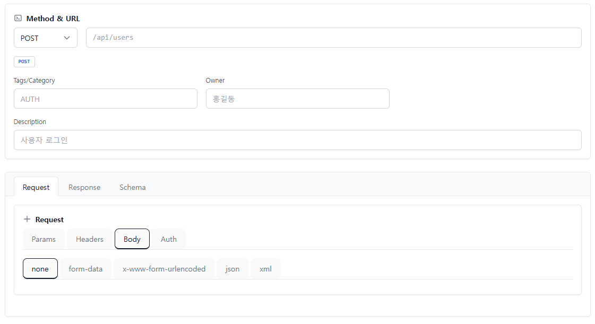
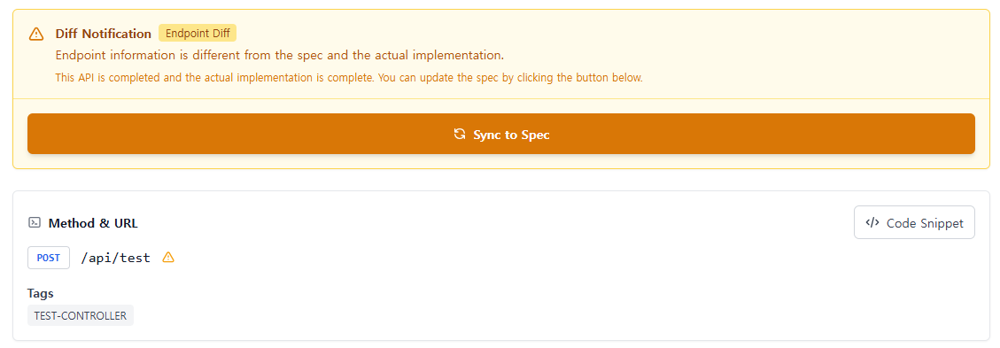
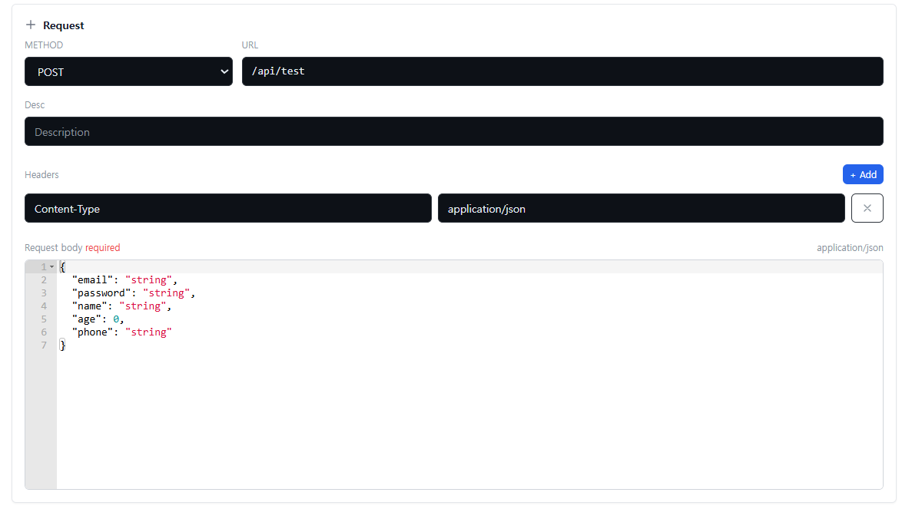
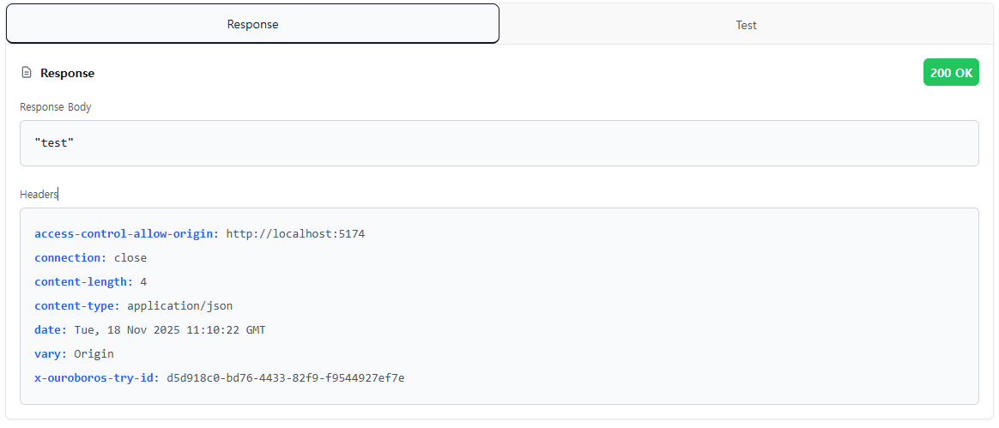
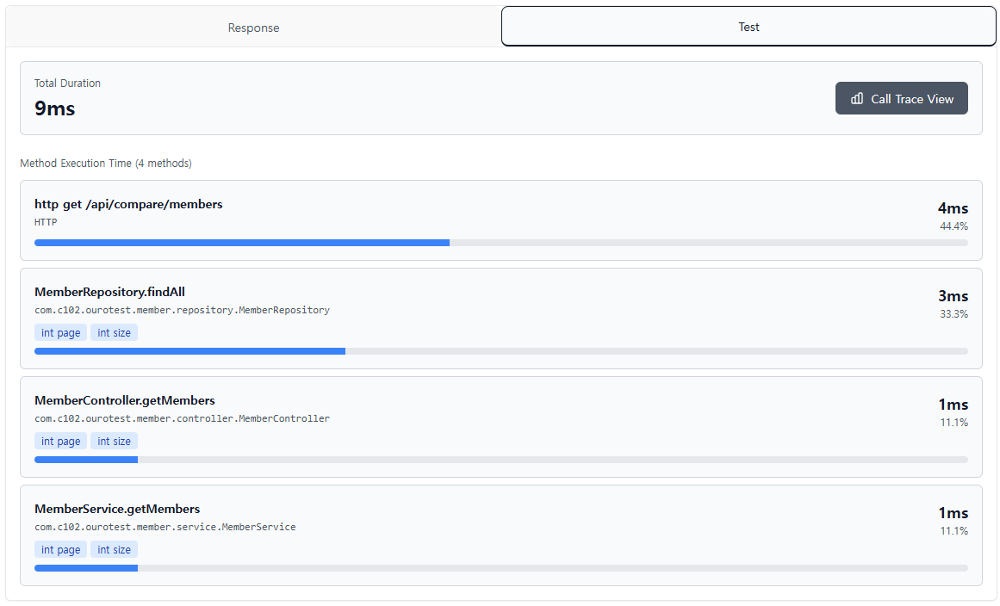
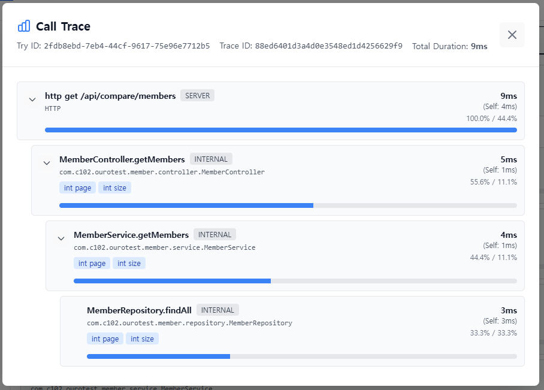

# 🐍 Ouroboros

<div align="center">


**OpenAPI 3.1.0 기반 REST API 명세 관리 및 Mock 서버 라이브러리**

[English](../../README.md) | **한국어**

[시작하기](#-빠른-시작) • [문서](#-문서) • [기여하기](./CONTRIBUTING.md) • [라이선스](#-라이선스)

</div>

---

## 📖 목차

- [소개](#-소개)
- [주요 기능](#-주요-기능)
- [아키텍처](#-아키텍처)
- [빠른 시작](#-빠른-시작)
- [사용자 인터페이스](#️-사용자-인터페이스)
- [사용법](#-사용법)
- [문서](#-문서)
- [기여하기](#-기여하기)
- [라이선스](#-라이선스)
- [팀](#-팀)

---

## 🎯 소개

**Ouroboros**는 REST API 개발 라이프사이클을 혁신하는 Spring Boot 라이브러리입니다. OpenAPI 3.1.0 표준을 기반으로 API 명세를 관리하고, 자동으로 Mock 서버를 생성하며, API 검증 및 테스트 기능을 제공합니다.

### 왜 Ouroboros인가?

- **명세 우선 개발**: OpenAPI 명세를 먼저 작성하고, 실제 구현은 나중에
- **즉시 사용 가능한 Mock 서버**: 프론트엔드 개발이 백엔드를 기다릴 필요 없음
- **자동 검증**: 실제 구현과 명세의 일치성을 자동으로 검증
- **개발자 친화적**: 직관적인 웹 UI와 RESTful API 제공
- **경량 라이브러리**: 기존 Spring Boot 애플리케이션에 간단히 추가

> 🎬 **Ouroboros가 처음이신가요?** 주요 워크플로우를 보여주는 애니메이션 GIF가 포함된 [사용자 가이드](./USER_GUIDE.md)를 확인해보세요!

---

## ✨ 주요 기능

### 🔧 API 명세 관리
- ✅ **OpenAPI 3.1.0 완벽 지원**: 최신 OpenAPI 표준 준수
- ✅ **CRUD 작업**: REST API 명세 생성, 조회, 수정, 삭제
- ✅ **스키마 재사용**: `$ref`를 통한 스키마 참조 및 중복 제거
- ✅ **YAML Import/Export**: 외부 OpenAPI 파일 가져오기 및 내보내기
- ✅ **중복 감지**: path + method 조합 중복 자동 검증
- ✅ **버전 관리**: API 진행 상태 추적 (mock, implementing, completed)

### 🎭 자동 Mock 서버
- ✅ **즉시 사용 가능**: 명세 작성 즉시 Mock API 생성
- ✅ **실전 같은 데이터**: DataFaker 통합으로 실제적인 Mock 데이터 생성
- ✅ **요청 검증**: 파라미터, 헤더, 본문 자동 검증
- ✅ **다양한 형식 지원**: JSON, XML, Form Data 등
- ✅ **커스텀 Mock 표현식**: `x-ouroboros-mock` 필드로 세밀한 제어

### 🖥️ 웹 인터페이스
- ✅ **React 기반 모던 UI**: 직관적이고 반응형 웹 인터페이스
- ✅ **실시간 미리보기**: API 명세 변경사항 즉시 확인
- ✅ **코드 스니펫 생성**: cURL, JavaScript, Python 등 다양한 언어
- ✅ **Markdown 내보내기**: API 문서 자동 생성

### 🔍 검증 및 QA
- ✅ **명세 검증**: OpenAPI 표준 준수 여부 검증
- ✅ **실제 구현 비교**: `@ApiState` 어노테이션으로 코드와 명세 동기화
  - ⚠️ **`@ApiState`가 있는 메서드만 스캔되고 검증됩니다** - 이 어노테이션이 없는 메서드는 검증에서 제외됩니다
- ✅ **자동 Enrichment**: 누락된 Ouroboros 확장 필드 자동 추가
- ✅ **에러 리포팅**: 상세한 검증 에러 메시지
- ✅ **Try 기능**: API 실행 추적 및 분석 (📖 [설정 가이드](./OUROBOROS_TRY_SETUP.md))
  - **기본값**: In-memory trace 저장소 (설정 불필요)

### 🌐 WebSocket/STOMP API 관리
- ✅ **AsyncAPI 3.0.0 지원**: WebSocket/STOMP API 명세 완벽 지원
- ✅ **채널 관리**: STOMP destination(채널) 생성 및 관리
- ✅ **오퍼레이션 관리**: Reply 설정이 포함된 send/receive 오퍼레이션 정의
- ✅ **메시지 컴포넌트**: WebSocket 통신을 위한 재사용 가능한 메시지 정의
- ✅ **스키마 관리**: WebSocket 메시지 페이로드를 위한 공유 스키마
- ✅ **코드 스캔**: Springwolf를 통한 자동 코드 스캔 (선택사항)
- ✅ **WebSocket Try**: WebSocket/STOMP 메시지 성능 추적

> **⚠️ WebSocket 코드 스캔 시 중요사항**:
> - **채널 주소에 prefix 포함 필수**: WebSocket 명세를 작성할 때 채널 주소는 애플리케이션 destination prefix를 포함한 전체 경로로 작성해야 합니다. 예를 들어, `@MessageMapping`이 `/chat/send`이고 prefix가 `/app`인 경우, 명세서에는 `/app/chat/send`로 작성해야 합니다.
> - **어노테이션 필수**: `@MessageMapping`과 `@SendTo` 어노테이션이 붙은 메서드만 스캔됩니다. 이 어노테이션이 없는 메서드는 코드 스캔에 포함되지 않습니다.

---

## 🏗️ 아키텍처

### 전체 구조

```
┌──────────────────────────────────────────────────────────────┐
│                        사용자 애플리케이션                        │
│  ┌────────────────────────────────────────────────────────┐  │
│  │                    Spring Boot App                      │  │
│  │  ┌──────────────┐  ┌──────────────┐  ┌─────────────┐  │  │
│  │  │ Controllers  │  │   Services   │  │   Models    │  │  │
│  │  │  @ApiState   │  │              │  │             │  │  │
│  │  └──────────────┘  └──────────────┘  └─────────────┘  │  │
│  └────────────────────────────────────────────────────────┘  │
│                              │                                │
│                 ┌────────────▼────────────┐                  │
│                 │  Ouroboros Library      │                  │
│                 │  ┌──────────────────┐   │                  │
│                 │  │  Auto Config     │   │                  │
│                 │  ├──────────────────┤   │                  │
│                 │  │  Mock Filter     │◄──┼── Mock Requests │
│                 │  ├──────────────────┤   │                  │
│                 │  │  Spec Manager    │   │                  │
│                 │  ├──────────────────┤   │                  │
│                 │  │  YAML Parser     │   │                  │
│                 │  ├──────────────────┤   │                  │
│                 │  │  Validator       │   │                  │
│                 │  └──────────────────┘   │                  │
│                 └──────────┬──────────────┘                  │
│                            │                                  │
│                 ┌──────────▼──────────┐                      │
│                 │   ourorest.yml      │                      │
│                 │  (OpenAPI 3.1.0)    │                      │
│                 └─────────────────────┘                      │
└──────────────────────────────────────────────────────────────┘
```

### 핵심 컴포넌트

#### Backend (Spring Boot Library)
- **`core/global`**: 자동 설정, 응답 포맷, 예외 처리
- **`core/rest/spec`**: REST API 명세 CRUD 서비스
- **`core/rest/mock`**: Mock 서버 필터 및 레지스트리
- **`core/rest/validation`**: OpenAPI 검증 및 Enrichment
- **`core/rest/tryit`**: try 요청에 대한 내부 메서드 호출 추적
- **`core/websocket/spec`**: WebSocket/STOMP API 명세 CRUD 서비스
- **`core/websocket/handler`**: WebSocket 프로토콜 핸들러 (Springwolf 사용/미사용)
- **`core/websocket/tryit`**: try 요청에 대한 WebSocket 메시지 추적
- **`ui/rest/controller`**: REST API 엔드포인트
- **`ui/websocket/controller`**: WebSocket API 엔드포인트

#### Frontend (React + TypeScript)
- **`features/spec`**: API 명세 편집기 및 뷰어
- **`features/sidebar`**: 엔드포인트 네비게이션
- **`services`**: 백엔드 API 통신
- **`store`**: Zustand 상태 관리

#### 데이터 저장
- **`ourorest.yml`**: 모든 REST API 명세를 담은 단일 OpenAPI 파일
  - **위치**: `{프로젝트}/src/main/resources/ouroboros/rest/ourorest.yml`
- **`ourowebsocket.yml`**: 모든 WebSocket/STOMP API 명세를 담은 단일 AsyncAPI 파일
  - **위치**: `{프로젝트}/src/main/resources/ouroboros/websocket/ourowebsocket.yml`

---

## 🚀 빠른 시작

### 전제 조건
- ☕ Java 17 이상
- 🍃 Spring Boot 3.x
- 📦 Gradle 또는 Maven

### 설치

> **⚠️ 버전 경고**: 1.0.2 버전은 에러가 발생하므로 사용하지 마세요. 반드시 1.0.4 버전을 사용해주세요.

#### Gradle
```gradle
dependencies {
    implementation 'io.github.whitesnakegang:ouroboros:1.0.4'
    implementation 'org.springframework.boot:spring-boot-starter-web'
}
```

#### Maven
```xml
<dependency>
    <groupId>io.github.whitesnakegang</groupId>
    <artifactId>ouroboros</artifactId>
    <version>1.0.4</version>
</dependency>
```

> **⚠️ 중요**: 
> - Lombok을 사용하는 경우 반드시 <code>annotationProcessor 'org.projectlombok:lombok'</code>를 추가해야 <code>lombok</code> 기반 자동 스캔이 정상 동작합니다.
> - **`@ApiState` 어노테이션은 코드 스캔 및 검증에 필수입니다**: `@ApiState` 어노테이션이 붙은 컨트롤러 메서드만 코드 스캔에 포함됩니다. 이 어노테이션이 없는 메서드는 **스캔되지 않으며** 명세와의 **검증도 수행되지 않습니다**. Ouroboros가 API 구현을 추적하고 검증하려면 모든 컨트롤러 메서드에 `@ApiState`를 추가해야 합니다.

### 설정 (선택 사항)

> **Method Tracing**: 내부 메서드 추적은 기본적으로 비활성화되어 있습니다. Try 기능에서 내부 메서드를 추적하려면 `method-tracing` 설정을 추가해야 합니다.

`application.yml`:
```yaml
ouroboros:
  enabled: true  # 기본값: true
  server:
    url: http://localhost:8080
    description: Local Development Server
  # Method Tracing 설정 (Try 기능에서 내부 메서드 추적 시 필요)
  # 기본적으로 내부 메서드 추적은 비활성화되어 있습니다
  method-tracing:
    enabled: true
    allowed-packages: your.package.name  # 추적할 패키지 경로 지정

# WebSocket 설정 (선택사항)
# WebSocket 명세서 작성만 하고 코드 스캔/비교를 사용하지 않는 경우:
springwolf:
  enabled: false  # Springwolf 비활성화 (명세서 작성만)

# WebSocket 코드 스캔, 명세 비교, 테스트를 사용하는 경우:
springwolf:
  enabled: true
  docket:
    info:
      title: WebSocket API
      version: 1.0.0
      description: WebSocket API Description
    servers:
      websocket:
        host: localhost:8080
        protocol: ws
        description: WebSocket Server
    base-package: com.yourpackage  # @MessageMapping 어노테이션을 스캔할 패키지
```

### 사용 시작

1. **Spring Boot 애플리케이션 실행**
   ```bash
   ./gradlew bootRun
   ```

2. **웹 UI 접속** 🖥️
   
   브라우저에서 다음 주소로 접속하세요:
   ```
   http://localhost:8080/ouroboros
   ```
   
   직관적인 웹 인터페이스에서 다음을 할 수 있습니다:
   - ✅ API 명세를 시각적으로 생성하고 편집
   - ✅ 드래그 앤 드롭으로 스키마 관리
   - ✅ 실시간으로 API 문서 미리보기
   - ✅ OpenAPI YAML 파일 가져오기/내보내기
   - ✅ 코드 스니펫 생성 (cURL, JavaScript, Python 등)

   > 🎬 **워크플로우 학습**: 단계별 애니메이션 GIF가 포함된 [사용자 가이드](./USER_GUIDE.md)를 확인하세요!

3. **첫 번째 API 명세 생성**
   
   웹 UI에서:
   1. "New API" 버튼 클릭
   2. 폼 작성 (경로, 메서드, 요약 등)
   3. 요청/응답 스키마 정의
   4. "저장" 클릭 - Mock API가 바로 준비됩니다!

4. **Mock API 즉시 테스트**
   
   생성한 API는 지정한 경로에서 바로 사용 가능:
   ```bash
   curl http://localhost:8080/api/users
   # 자동으로 Mock 데이터 반환!
   ```

> 💡 **Pro Tip**: 프로그래밍 방식의 접근을 선호한다면 REST API 엔드포인트를 직접 사용할 수도 있습니다. 자세한 내용은 [API 문서](../../backend/docs/endpoints/README.md)를 참고하세요.

---

## 🖥️ 사용자 인터페이스

Ouroboros는 API 명세 관리를 위한 직관적인 웹 기반 인터페이스를 제공합니다. 모든 작업은 코드 작성 없이 GUI를 통해 수행할 수 있습니다.

### 전체 화면

전체 GUI를 통해 명세서 작성 및 확인이 가능합니다. 인터페이스는 세 가지 주요 영역으로 구성됩니다: 네비게이션을 위한 사이드바, 명세서를 보기 및 편집하는 메인 콘텐츠 영역, 테스트 및 검증을 위한 액션 패널입니다.



**주요 영역**:
- **왼쪽 사이드바**: 모든 API 엔드포인트, 스키마, WebSocket 오퍼레이션 탐색
- **메인 콘텐츠 영역**: API 명세, 스키마, 메시지 보기 및 편집
- **액션 패널**: API 테스트, 검증 결과 확인, 성능 분석

### 사이드바 (상태 뱃지)

사이드바는 모든 API 엔드포인트를 상태 뱃지와 함께 표시하여 개발 여부를 한눈에 확인할 수 있습니다. 상태별로 필터링하고 어떤 API 명세로든 쉽게 이동할 수 있습니다.



**상태 뱃지**:
- 🟢 **Completed**: API가 완전히 구현되고 테스트됨
- 🟡 **Implementing**: API가 현재 개발 중
- 🔴 **Mock**: API가 명세서로만 존재 (아직 구현되지 않음)
- 🟠 **Bugfix**: API가 버그 수정 중

**기능**:
- 엔드포인트를 클릭하여 상세 정보 확인
- 상태 필터 버튼을 사용하여 상태별로 엔드포인트 필터링
- 태그나 경로별로 엔드포인트 그룹화
- 새 API, 스키마, 오퍼레이션 생성 빠른 접근

### API 상세 페이지

상세 페이지를 통해 API 명세 내용을 확인할 수 있습니다. 요청/응답 스키마, 파라미터, 메타데이터 등이 포함됩니다. 모든 정보는 쉬운 탐색을 위해 탭으로 구성되어 있습니다.



**기능**:
- **개요 탭**: 경로, 메서드, 요약, 설명, 태그를 포함한 완전한 API 명세 확인
- **요청 탭**: 요청 파라미터, 헤더, 쿼리 파라미터, 요청 본문 스키마 구성
- **응답 탭**: 다양한 상태 코드(200, 201, 400, 404 등)에 대한 응답 스키마 정의
- **테스트 탭**: API 테스트 실행 및 응답 확인
- **검증 탭**: 검증 상태 및 명세와 구현 간의 불일치 확인
- **코드 스니펫**: 다양한 언어(cURL, JavaScript, Python 등)로 코드 예제 생성
- **내보내기**: Markdown 또는 OpenAPI YAML 형식으로 API 문서 내보내기

**빠른 작업**:
- 페이지에서 직접 API 세부 정보 편집
- 요청/응답 본문에 재사용 가능한 스키마 참조
- 개발 진행 상태 및 태그 설정
- 검증 상태 확인 및 변경사항 적용

### 명세 작성 페이지

직관적인 폼 기반 편집기를 통해 API 명세를 생성하고 편집할 수 있습니다. 편집기는 API의 모든 측면을 정의하기 위한 단계별 워크플로우를 제공합니다.



**편집기 섹션**:
- **기본 정보**: 경로, HTTP 메서드(GET, POST, PUT, DELETE 등), 요약, 설명 정의
- **요청 구성**: 
  - 경로 파라미터, 쿼리 파라미터, 헤더 추가
  - 요청 본문 스키마 정의(기존 스키마 참조 또는 인라인 생성)
  - 콘텐츠 타입 설정(application/json, application/xml 등)
- **응답 구성**:
  - 각 상태 코드에 대한 응답 정의 추가
  - 응답 헤더 및 본문 스키마 정의
  - 응답 콘텐츠 타입 설정
- **메타데이터**: 개발 진행 상태(mock/completed), 태그(none/implementing/bugfix), 검증 상태 설정

**기능**:
- `{"ref": "SchemaName"}`을 사용하여 재사용 가능한 스키마 참조
- 스키마 이름 및 필드 경로에 대한 자동 완성
- OpenAPI 3.1.0 준수 실시간 검증
- 생성된 OpenAPI 명세 미리보기

### 검증 화면

검증 화면은 명세서와 실제 구현 간의 불일치를 보여주며, 검증 결과를 확인하고 반영할 수 있습니다. 이를 통해 API 문서와 실제 코드 간의 일관성을 유지할 수 있습니다.



**검증 유형**:
- **요청 검증**: 요청 파라미터, 헤더, 본문 스키마 비교
- **응답 검증**: 응답 상태 코드, 헤더, 본문 스키마 비교
- **엔드포인트 검증**: 명세와 구현 간의 경로 및 메서드 일치 여부 확인
- **Both**: 요청과 응답이 모두 명세와 다른 경우

**기능**:
- **시각적 차이 표시**: 명세와 구현 간의 정확한 차이점 확인
- **원클릭 동기화**: 한 번의 클릭으로 코드의 변경사항을 명세에 적용
- **검증 상태 뱃지**: 각 엔드포인트의 검증 상태 표시(Valid/Invalid/Diff detected)
- **상세 보고서**: 모든 엔드포인트에 대한 포괄적인 검증 보고서 확인
- **상태별 필터**: 검증 상태별로 엔드포인트 필터링하여 빠른 검토

**워크플로우**:
1. 코드 스캔 후 검증 결과 확인
2. 인터페이스에서 강조된 불일치 사항 검토
3. 명세와 코드를 동기화하기 위해 변경사항 적용
4. 각 엔드포인트의 검증 상태 추적

### 테스트 화면

테스트 화면에서 API를 테스트하고 Mock 및 실제 응답 결과를 확인할 수 있으며, 메서드별 시간 추적도 가능합니다. 인증 설정, 요청 파라미터 설정, 성능 분석을 한 곳에서 수행할 수 있습니다.



**테스트 구성**:
- **요청 설정**: 경로 파라미터, 쿼리 파라미터, 헤더, 요청 본문 구성
- **인증**: 인증된 요청을 위한 Bearer 토큰, API 키 또는 커스텀 헤더 설정
- **환경**: 다양한 환경(개발, 스테이징, 프로덕션) 간 전환



**응답 확인**:
- **Mock 응답**: 명세에서 생성된 Mock 데이터로 테스트(프론트엔드 개발에 유용)
- **실제 응답**: 실제 백엔드 구현으로 테스트
- **나란히 비교**: Mock vs 실제 응답을 비교하여 구현 정확성 검증
- **응답 상세**: 상태 코드, 헤더, 포맷된 응답 본문(JSON, XML 등) 확인



**메서드 성능 추적**:
- **간단 보기**: 전체 요청 실행 시간 및 주요 메서드 타이밍을 한눈에 확인
- **상세 보기**: 메서드별 실행 시간 및 호출 계층 구조 심층 분석



**성능 분석**:
- **실행 타임라인**: 각 메서드가 호출된 시점을 보여주는 시각적 타임라인
- **메서드 계층 구조**: 메서드 호출 관계를 보여주는 트리 뷰
- **성능 메트릭**: 
  - 전체 요청 실행 시간
  - 개별 메서드 실행 시간
  - 데이터베이스 쿼리 지속 시간(해당되는 경우)
  - 외부 API 호출 시간(해당되는 경우)
- **병목 지점 식별**: 느린 메서드 및 잠재적 성능 문제 자동 강조
- **N+1 감지**: 데이터베이스 작업에서 N+1 쿼리 문제 식별

**기능**:
- **TEST 탭**: TEST 탭으로 이동하여 상세한 메서드 추적 확인
- **요청 이력**: 이전 테스트 요청 확인 및 재실행
- **결과 내보내기**: 테스트 결과 및 성능 메트릭 내보내기

> 📖 **단계별 워크플로우와 애니메이션 GIF는 [사용자 가이드](./USER_GUIDE.md)를 참고하세요**

---

## 📚 사용법

### 기본 워크플로우 (웹 UI 사용)

#### 1단계: 재사용 가능한 스키마 정의
1. 웹 UI에서 **"스키마"** 탭으로 이동
2. 스키마 폼 작성:
   - **이름**: `User`
   - **타입**: `object`
   - 속성 추가:
     - `id` (string) - Mock: `{{random.uuid}}`
     - `name` (string) - Mock: `{{name.fullName}}`
     - `email` (string) - Mock: `{{internet.emailAddress}}`
   - `id`와 `name`을 필수 필드로 지정
3. **"저장"** 클릭

#### 2단계: API 명세 생성
1. **"API"** 탭으로 이동
2. **"새 API"** 버튼 클릭
3. API 폼 작성:
   - **경로**: `/api/users`
   - **메서드**: `POST`
   - **요약**: `사용자 생성`
   - **요청 본문**: `User` 스키마 참조
   - **응답 (201)**: `User` 스키마 참조
   - **진행 상태**: `mock`
4. **"저장"** 클릭 - Mock API가 바로 동작합니다!

#### 3단계: Mock API 테스트
Mock API가 즉시 사용 가능합니다:

```bash
curl -X POST http://localhost:8080/api/users \
  -H "Content-Type: application/json" \
  -d '{"name": "홍길동", "email": "hong@example.com"}'

# 응답 (자동 생성):
{
  "id": "a3b5c7d9-1234-5678-90ab-cdef12345678",
  "name": "홍길동",
  "email": "hong@example.com"
}
```

#### 4단계: 실제 구현 및 검증 (백엔드 개발자)
Controller에 `@ApiState` 어노테이션 추가:

```java
@RestController
@RequestMapping("/api/users")
public class UserController {
    
    @PostMapping
    @ApiState(
        state = ApiState.State.IMPLEMENTING,
        owner = "backend-team",
        description = "사용자 생성 API 구현 중"
    )
    public ResponseEntity<User> createUser(@RequestBody User user) {
        // 실제 구현...
        return ResponseEntity.status(201).body(savedUser);
    }
}
```

> **⚠️ 중요**: **`@ApiState` 어노테이션이 있는 메서드만 스캔되고 검증됩니다**. 컨트롤러 메서드에 `@ApiState`를 추가하지 않으면:
> - ❌ 해당 메서드는 코드 스캔에 **포함되지 않습니다**
> - ❌ 해당 메서드는 명세와의 **검증이 수행되지 않습니다**
> - ❌ 명세-구현 비교가 해당 엔드포인트에서 **작동하지 않습니다**
> 
> 자동 검증을 활성화하려면 추적하려는 모든 컨트롤러 메서드에 **반드시** `@ApiState`를 추가해야 합니다.

애플리케이션 시작 시 Ouroboros가 `@ApiState`가 붙은 모든 메서드에 대해 자동으로 구현과 명세를 비교하여 검증합니다.

#### 5단계: 상태 업데이트
구현 완료 후 웹 UI에서 상태 업데이트:
1. 목록에서 해당 API 선택
2. **진행 상태**를 `mock`에서 `completed`로 변경
3. **"저장"** 클릭

### 외부 OpenAPI 파일 가져오기

1. 웹 UI에서 **"Import"** 버튼 클릭
2. OpenAPI YAML 파일 선택 (`.yml` 또는 `.yaml`)
3. **"업로드"** 클릭

Ouroboros가 자동으로:
- ✅ OpenAPI 3.1.0 표준 준수 여부 검증
- ✅ 중복 API/스키마 처리 (`-import` 접미사로 자동 이름 변경)
- ✅ Ouroboros 확장 필드 추가
- ✅ 모든 `$ref` 참조 자동 업데이트

> 📖 **프로그래밍 방식으로 사용**하려면 [REST API 문서](../../backend/docs/endpoints/README.md)를 참고하세요

---

## 📖 문서

### 공식 사이트
- [https://ouroboros.co.kr](https://ouroboros.co.kr) — 최신 가이드와 배포 문서를 확인할 수 있습니다.

### API 문서
- [API 엔드포인트 전체 문서](../../backend/docs/endpoints/README.md)
- [REST API 명세 관리](../../backend/docs/endpoints/01-create-rest-api-spec.md)
- [스키마 관리](../../backend/docs/endpoints/06-create-schema.md)
- [WebSocket 오퍼레이션 관리](../../backend/docs/endpoints/12-create-websocket-operation.md)
- [WebSocket 스키마 및 메시지 관리](../../backend/docs/endpoints/README.md#websocket-스키마-관리)
- [YAML Import](../../backend/docs/endpoints/11-import-yaml.md)

### 사용자 가이드
- 🎬 **[사용자 가이드 (애니메이션 워크플로우)](./USER_GUIDE.md)** - GIF가 포함된 단계별 워크플로우:
  - REST API에서 스키마 생성 및 사용
  - 테스트를 위한 인증 설정
  - 메서드별 성능 결과 확인
  - WebSocket/STOMP 명세 생성
- [User Guide (English)](../USER_GUIDE.md) - Step-by-step workflows with GIFs

### 개발자 가이드
- [프로젝트 문서](../../backend/PROJECT_DOCUMENTATION.md)
- [GraphQL 설계](../../backend/docs/graphql/DESIGN.md)
- [트러블슈팅](../../backend/docs/troubleshooting/README.md)
- [Try 기능 설정 가이드](./OUROBOROS_TRY_SETUP.md)

### OpenAPI 확장 필드

Ouroboros는 OpenAPI 3.1.0에 다음 커스텀 필드를 추가합니다:

**Operation 레벨:**
- `x-ouroboros-id`: API 명세 고유 식별자 (UUID)
- `x-ouroboros-progress`: 개발 진행 상태 (`mock` | `completed`)
- `x-ouroboros-tag`: 개발 태그 (`none` | `implementing` | `bugfix`)
- `x-ouroboros-isvalid`: 검증 상태 (boolean)

**Schema 레벨:**
- `x-ouroboros-mock`: DataFaker 표현식 (예: `{{name.fullName}}`)
- `x-ouroboros-orders`: 필드 순서 배열

---

## 🤝 기여하기

Ouroboros는 오픈소스 프로젝트이며 여러분의 기여를 환영합니다!

### 기여 방법

1. **이슈 확인**: [GitHub Issues](https://github.com/whitesnakegang/ouroboros/issues)에서 작업할 이슈 찾기
2. **Fork & Clone**: 저장소를 Fork하고 로컬에 Clone
3. **브랜치 생성**: `feature/기능명` 또는 `fix/버그명` 브랜치 생성
4. **개발**: 코드 작성 및 테스트
5. **커밋**: [커밋 컨벤션](./CONTRIBUTING.md#커밋-메시지-규칙) 준수
6. **Pull Request**: `develop` 브랜치로 PR 생성

자세한 내용은 [기여 가이드](./CONTRIBUTING.md)를 참고하세요.

### 행동 강령

이 프로젝트는 [행동 강령](./CODE_OF_CONDUCT.md)을 준수합니다. 참여함으로써 귀하는 이를 지키는 데 동의합니다.

---

## 📄 라이선스

이 프로젝트는 [Apache License 2.0](../../LICENSE) 라이선스를 따릅니다.

```
Copyright 2025 Whitesnakegang

Licensed under the Apache License, Version 2.0 (the "License");
you may not use this file except in compliance with the License.
You may obtain a copy of the License at

    http://www.apache.org/licenses/LICENSE-2.0

Unless required by applicable law or agreed to in writing, software
distributed under the License is distributed on an "AS IS" BASIS,
WITHOUT WARRANTIES OR CONDITIONS OF ANY KIND, either express or implied.
See the License for the specific language governing permissions and
limitations under the License.
```

---

## 👥 팀

### 메인테이너
- **Whitesnakegang** - *프로젝트 창시자 및 메인테이너* - [@whitesnakegang](https://github.com/whitesnakegang)

### 기여자
이 프로젝트에 기여해주신 모든 분들께 감사드립니다!

[전체 기여자 목록](https://github.com/whitesnakegang/ouroboros/graphs/contributors)

---

## 🔗 링크

- **GitHub**: https://github.com/whitesnakegang/ouroboros
- **Issues**: https://github.com/whitesnakegang/ouroboros/issues
- **Maven Central**: https://search.maven.org/artifact/io.github.whitesnakegang/ouroboros

---

## 📞 지원

문제가 있거나 질문이 있으신가요?

- 📝 [Issue 생성](https://github.com/whitesnakegang/ouroboros/issues/new)
- 💬 [Discussion 참여](https://github.com/whitesnakegang/ouroboros/discussions)

---

<div align="center">

**Ouroboros로 더 나은 API 개발을 경험하세요!**

⭐ 이 프로젝트가 도움이 되었다면 Star를 눌러주세요!

Made with ❤️ by [Whitesnakegang](https://github.com/whitesnakegang)

</div>

