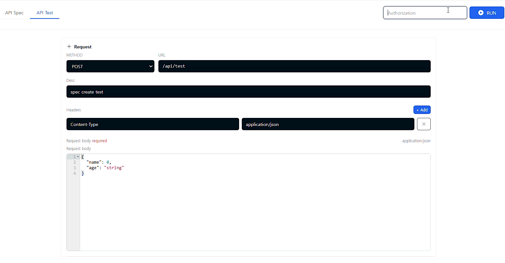

# 🎬 Ouroboros 사용자 가이드

이 가이드는 Ouroboros의 주요 워크플로우를 애니메이션 GIF와 단계별 설명으로 보여줍니다.

[English](../USER_GUIDE.md) | **한국어**

---

## 📋 목차

- [REST API 워크플로우](#rest-api-워크플로우)
  - [스키마 생성 및 사용](#스키마-생성-및-사용)
  - [테스트 실행 전 인증 설정](#테스트-실행-전-인증-설정)
  - [메서드 테스트 결과 보기](#메서드-테스트-결과-보기)
- [WebSocket/STOMP 워크플로우](#websocketstomp-워크플로우)
  - [스키마 → 메시지 → 오퍼레이션 생성](#스키마--메시지--오퍼레이션-생성)

---

## REST API 워크플로우

### 스키마 생성 및 사용

**워크플로우**: 재사용 가능한 스키마를 생성하고 요청/응답 정의에서 사용합니다.


**단계**:
1. **스키마** 탭으로 이동
2. 스키마 속성 정의 (이름, 타입, 필드)
3. DataFaker 문법을 사용하여 필드에 Mock 표현식 설정
4. 스키마 저장
5. Response,Request 작성시 스키마 참조하여 필드 설정.

**장점**:
- ✅ 여러 API에서 스키마를 재사용하여 중복 제거
- ✅ API 명세 전반에 걸쳐 일관성 유지
- ✅ 한 번 업데이트하면 모든 곳에 반영

---

### 테스트 실행 전 인증 설정

**워크플로우**: API 테스트를 실행하기 전에 인증 설정을 구성합니다.



**단계**:
1. API의 **Try/Test** 탭으로 이동
2. **"Authentication"** 또는 **"Auth"** 버튼 클릭
3. 인증 값 입력.
4. 인증 설정 저장
5. 모든 테스트 요청에 인증이 자동으로 포함됩니다

**장점**:
- ✅ 코드에 자격 증명을 노출하지 않고 안전한 API 테스트
- ✅ 여러 테스트에서 재사용 가능한 인증 설정
- ✅ 다양한 인증 방법 지원

---

### 메서드 테스트 결과 보기

**워크플로우**: API 테스트를 실행하고 상세한 메서드별 성능 결과를 확인합니다.


**단계**:
1. API의 **API Test** 탭으로 이동
2. 요청 파라미터, 헤더, 본문 입력 (필요한 경우)
3. **"Run"** 버튼 클릭
4. **Response** 패널에서 응답 확인
5. **"TEST"** 탭으로 이동
6. 메서드별 실행 시간 확인:
   - 전체 요청 시간
   - 서비스 메서드 실행 시간
7. 성능 병목 지점과 느린 메서드 식별

**장점**:
- ✅ API의 성능 병목 지점 식별
- ✅ 메서드 실행 시간 추적
- ✅ N+1 쿼리 문제 감지
- ✅ 느린 데이터베이스 쿼리 최적화

---

## WebSocket/STOMP 워크플로우

### 스키마 → 메시지 → 오퍼레이션 생성

**워크플로우**: 스키마, 메시지, 오퍼레이션을 순차적으로 생성하여 완전한 WebSocket API 명세를 만듭니다.


**단계**:

#### 1. 스키마 생성
1. **WebSocket** → **Schemas** 탭으로 이동
2. 스키마 속성 정의
3. 스키마 저장

#### 2. 메시지 생성
1. **WebSocket** → **Messages** 탭으로 이동
2. 메시지 이름 설정
3. payload 및 header 설정
4. 메시지 저장

#### 3. 오퍼레이션 생성
1. **WebSocket** → **receive**,**reply** 탭으로 이동
2. **address** 입력,**message** 선택.
   - **address**입력 시 /app/chat/send 등 full address 입력.
3.  저장

> **⚠️ 중요 사항**:
> - **채널 주소 형식**: 명세서에 채널 주소를 작성할 때는 prefix를 포함한 전체 경로로 작성해야 합니다. 예를 들어, `@MessageMapping` 어노테이션이 `/chat/send`이고 애플리케이션 destination prefix가 `/app`인 경우, 명세서에는 `/app/chat/send`로 작성해야 합니다.
> - **코드 스캔 요구사항**: `@MessageMapping`과 `@SendTo` 어노테이션이 붙은 메서드만 Springwolf에 의해 스캔됩니다. 이 어노테이션이 없는 메서드는 자동 코드 스캔에 포함되지 않습니다.

**전체 흐름**:
```
스키마 (데이터 구조)
    ↓
메시지 (스키마 참조가 포함된 메시지 정의)
    ↓
오퍼레이션 (메시지가 포함된 Send/Receive 액션)
```

**장점**:
- ✅ WebSocket API 설계를 위한 구조화된 접근 방식
- ✅ 오퍼레이션 전반에 걸쳐 스키마 및 메시지 재사용
- ✅ 관심사 분리 (데이터, 메시지, 액션)
- ✅ 유지보수 및 업데이트 용이

---

## 🎯 팁 & 모범 사례

### 스키마 설계
- **스키마부터 시작**: API를 생성하기 전에 데이터 구조를 먼저 정의
- **설명적인 이름 사용**: 스키마 이름은 목적을 명확히 나타내야 함
- **초기에 Mock 표현식 설정**: 스키마 생성 중 Mock 데이터 생성 구성 (스키마 편집기의 Mock Expression 필드 사용)

### 인증
- **인증 테스트**: 전체 API 테스트를 실행하기 전에 인증이 작동하는지 확인
- **자격 증명 순환**: 보안을 위해 정기적으로 인증 토큰 업데이트

### 테스트
- **성능 모니터링**: 정기적으로 메서드 실행 시간 확인
- **Mock vs 실제 비교**: Mock 응답으로 프론트엔드 검증 후 실제 백엔드로 테스트

### WebSocket 개발
- **먼저 설계**: 구현 전에 WebSocket API 구조 계획
- **컴포넌트 재사용**: 여러 오퍼레이션에서 스키마 및 메시지 활용
- **채널 주소에 prefix 포함**: 항상 애플리케이션 destination prefix를 포함한 전체 경로 작성 (예: `/app/chat/send`, `/chat/send` 아님)
- **필수 어노테이션 사용**: 코드 스캔을 활성화하려면 `@MessageMapping`과 `@SendTo` 어노테이션 추가

---

## 📚 관련 문서

- [빠른 시작 가이드](../README.md#-빠른-시작)
- [API 문서](./backend/docs/endpoints/README.md)
- [Try 기능 설정](./OUROBOROS_TRY_SETUP.md)
- [트러블슈팅](./backend/docs/troubleshooting/README.md)

---

## 💬 도움이 필요하신가요?

- 📝 [Issue 생성](https://github.com/whitesnakegang/ouroboros/issues/new)
- 💬 [Discussion 참여](https://github.com/whitesnakegang/ouroboros/discussions)

---

<div align="center">

**Ouroboros로 즐거운 API 개발 되세요! 🐍**

Made with ❤️ by [Whitesnakegang](https://github.com/whitesnakegang)

</div>

